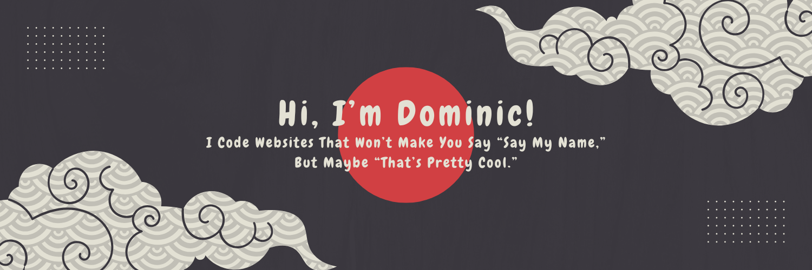

## 💫 About Me:

- 🎓 I am Dominic Esguerra, an IT Graduate from [Cavite State University CCAT](https://cvsu-rosario.edu.ph/).
- 🕹️ I Designed and Developed [The Adventures of Dara](https://github.com/dominic-myb/adventures-of-dara): A Cagayan Folklore Mobile Game, for my Capstone Project.
- ☕ I love turning coffee into code and websites!  
   

## 💻 Tech Stack:

     
  

## 📊 GitHub Stats:

